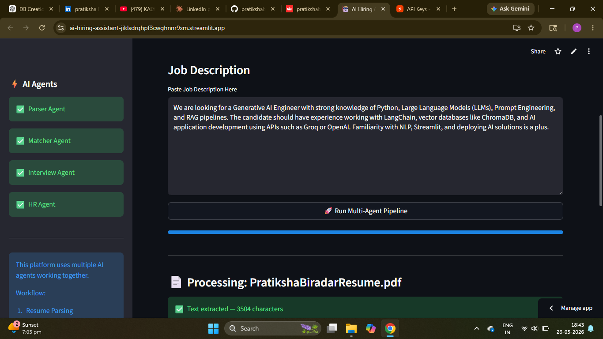
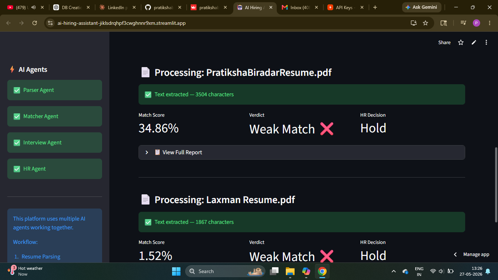
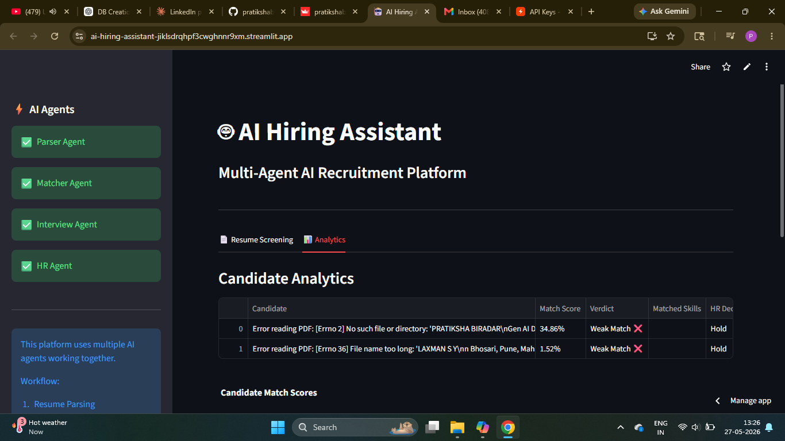
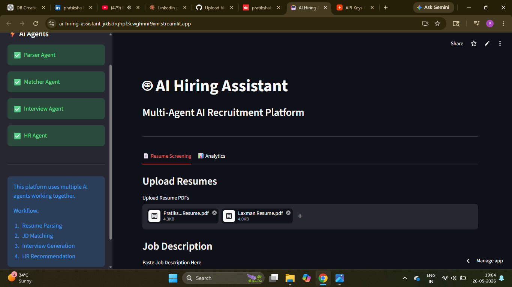

# 🤖 AI Hiring Assistant
### Multi-Agent AI Recruitment Platform

A production-ready AI-powered hiring platform that automates resume screening, 
candidate ranking, job description matching, and interview preparation using 
Multi-Agent Architecture, Groq LLM, and intelligent AI workflows.

---
## Badges 


## 🖥️ Demo Screenshot

### 1. Resume Upload & Job Description


### 2. Multi-Agent Pipeline Running


### 3. Match Score & Results


### 4. Analytics Dashboard

## 📌 Problem Statement

Recruiters spend hours manually reviewing resumes and shortlisting candidates. 
Traditional ATS systems fail to understand contextual skills and candidate-job 
fit effectively.

AI Hiring Assistant solves this using a **Multi-Agent AI Pipeline** with 4 
specialized AI agents working together to automate the entire hiring workflow.

---

## ✨ Features

- ✅ Bulk Resume Upload (PDF)
- ✅ AI Resume Parsing & Skill Extraction
- ✅ Job Description Matching with TF-IDF
- ✅ Match Score & Verdict Generation
- ✅ AI Interview Question Generator
- ✅ HR Report & Hiring Recommendation
- ✅ Candidate Analytics Dashboard
- ✅ CSV Export Support
- ✅ Multi-Agent Pipeline Architecture
- ✅ Live Streamlit Deployment

---

## 🧠 Multi-Agent System Workflow

### Agent Details:

| Agent | Role |
|---|---|
| Parser Agent | Extracts name, email, phone, skills, education from resume |
| Matcher Agent | TF-IDF cosine similarity matching against job description |
| Interview Agent | Generates 10 personalized interview questions using Groq LLM |
| HR Agent | Creates final HR report with hiring recommendation |

---

## 🏗️ Architecture

## 🏗️ System Architecture

Resume PDF → Parser Agent → Matcher Agent → Interview Agent → HR Agent → Final Report
                ↓               ↓                ↓              ↓
          Skill Extract    TF-IDF Score    10 Questions    HR Report + CSV

---

## 🛠️ Tech Stack

| Category | Technology |
|---|---|
| Language | Python |
| Frontend | Streamlit |
| LLM | Groq API (Llama 3.3 70B) |
| PDF Parsing | pdfplumber |
| Matching | Scikit-learn (TF-IDF) |
| Deployment | Streamlit Cloud |
| Version Control | GitHub |

--

## 📂 Project Structure

ai-hiring-assistant/
├── app.py              # Main Streamlit application
├── parser_agent.py     # Resume parsing agent
├── matcher_agent.py    # JD matching agent
├── interview_agent.py  # Interview question agent
├── hr_agent.py         # HR report agent
├── orchestrator.py     # Multi-agent coordinator
├── rag_engine.py       # RAG pipeline
├── pdf_utils.py        # PDF processing utilities
├── requirements.txt    # Dependencies
└── README.md

---

## ⚙️ Installation & Setup

### 1️⃣ Clone Repository
```bash
git clone https://github.com/pratikshabiradar19/ai-hiring-assistant.git
cd ai-hiring-assistant
```

### 2️⃣ Create Virtual Environment
```bash
python -m venv venv
venv\Scripts\activate
```

### 3️⃣ Install Dependencies
```bash
pip install -r requirements.txt
```

### 4️⃣ Configure API Key
Create a `.env` file:

Get your free Groq API key at 👉 https://console.groq.com/keys

### 5️⃣ Run Application
```bash
streamlit run app.py
```

---

## 🌐 Live Demo

👉 **https://ai-hiring-assistant-jiklsdrqhpf3cwghnnr9xm.streamlit.app/**

---

## 📊 How It Works

1. Upload one or multiple resume PDFs
2. Paste the job description
3. Click **"Run Multi-Agent Pipeline"**
4. Each resume goes through all 4 agents
5. View match scores, verdicts, interview questions
6. Download results as CSV

---

## 🔥 Key Highlights

- Multi-Agent AI architecture with 4 specialized agents
- Real-world ATS-inspired candidate ranking
- Groq LLM powered interview question generation
- Automated HR report with hiring recommendation
- TF-IDF cosine similarity for accurate JD matching
- Live Streamlit deployment with analytics dashboard
- Modular and scalable codebase

---

## 📦 Requirements

streamlit
groq
pdfplumber
scikit-learn
pandas
python-dotenv
langchain
chromadb

---

## 🚀 Future Improvements

- [ ] RAG-powered semantic resume understanding
- [ ] Multi-Agent Voice Interview System
- [ ] Recruiter Authentication
- [ ] Email Automation to candidates
- [ ] SQL Candidate Database
- [ ] Advanced ATS Scoring
- [ ] Docker Deployment
- [ ] FastAPI Backend Integration
- [ ] LinkedIn Profile Integration

---

## 👩‍💻 Author

**Pratiksha Biradar**
Gen AI Developer | Data Scientist | AI Engineer

- GitHub: https://github.com/pratikshabiradar19
- LinkedIn: https://www.linkedin.com/in/pratiksha-biradar-979b98315  ✅

---

## ⭐ Support

If you like this project, give it a star ⭐ and share it!

